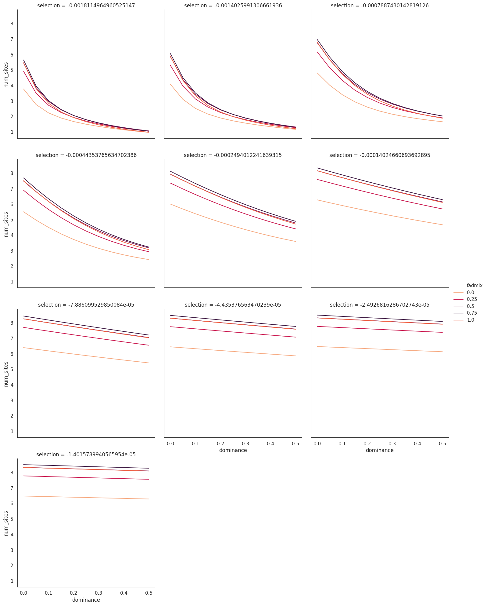

#Results of SLIM3 simulations

In this document we will look to some effects of negative selection under
different dominance constraints on the genetic variability of human admixed
populations. 

Using SILM3 we stimulated deleterious mutations in chromosomes of 1M bp with
selection coefficient sampled from a gamma distribution DFE (shape = -0.0065
and rate = 0.186). The mutations rate was set to 1e-17 and the recombination
rate used was 1e-8. For each simulation we assumed a fixed dominance
coefficient varying from  h= 0 (totally recessive effects) to h = 0.5 (additive
effects).  In addition to the fixed dominance we also simulated the model
proposed by Hubber el al 2018 where the dominance is a function of selection h
= 1/(a + b \* s) where h(s=0) = 1/a = 0.5 is the value of dominance of neutral
mutations and b = 1e6. 

Here we will show the results of simulations of humans Out-Of-Africa demography
inferred of by Jouganous2017. In this model, humans first expand its effective
population size from 11273 individuals to 23721 in the African Continent around
302 kyears (1 generation is equal 29 years). The Out-of-Africa split takes
place 125 kyears in the past with a population with 3004 effective size. The
European population starts to exponentially increase in its size around 42
kyears after starting from initial size of 2271 when a bottleneck took place.
Finally, we create 3 admixed population from a single pulse admixture between
the African and European population for with 0.25, 0.5, 0.75 proportions of
Africa ancestry.  

In the following figures the African poulation label is p1 the European
population label is p2, p3 and p4 have 25\%, 50\%, 75\%  of Africa ancestry.  

The boxplots summarizes the results of 100 simulations. 

### Morton Genetic load  

The Morton genetic load is defined as the average number of deleterious
mutations by individual in a population wich can be computed from as the sum of
the mean frequency of deleterious mutation (or sum of the first frequency
moment). 

### Genetic load 

The genetic load is defined as L = -s sum \[2h x1 + (1 - 2h) x2] 
(I forgot to multiply the load value by -1 in the figure)

### Genetic diversity

The genetic diversity is defined as the summation of the nucleotide
heterosigosity 

### Number of segregating sites 

## Conclusions 
  

## Caveats 

* The DFE used in this simulations is narows then the human the ones proposed
  in the recent literature. 
* The coefficient b used also is too big. 

