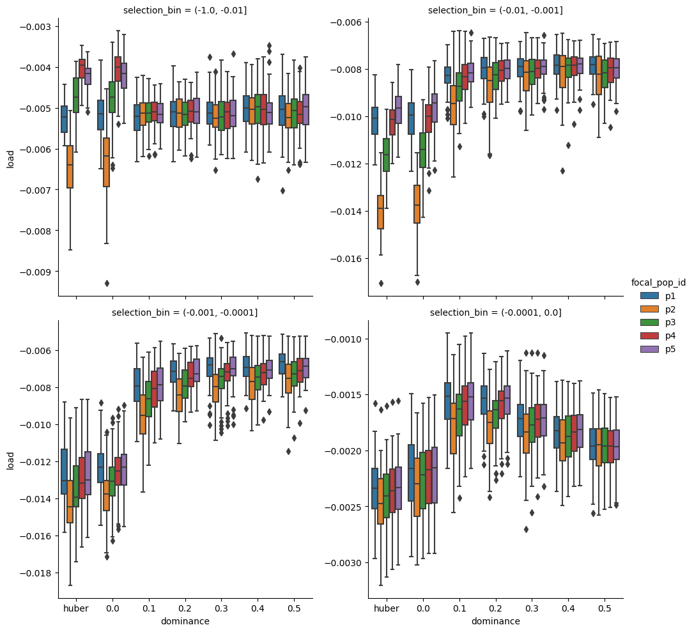
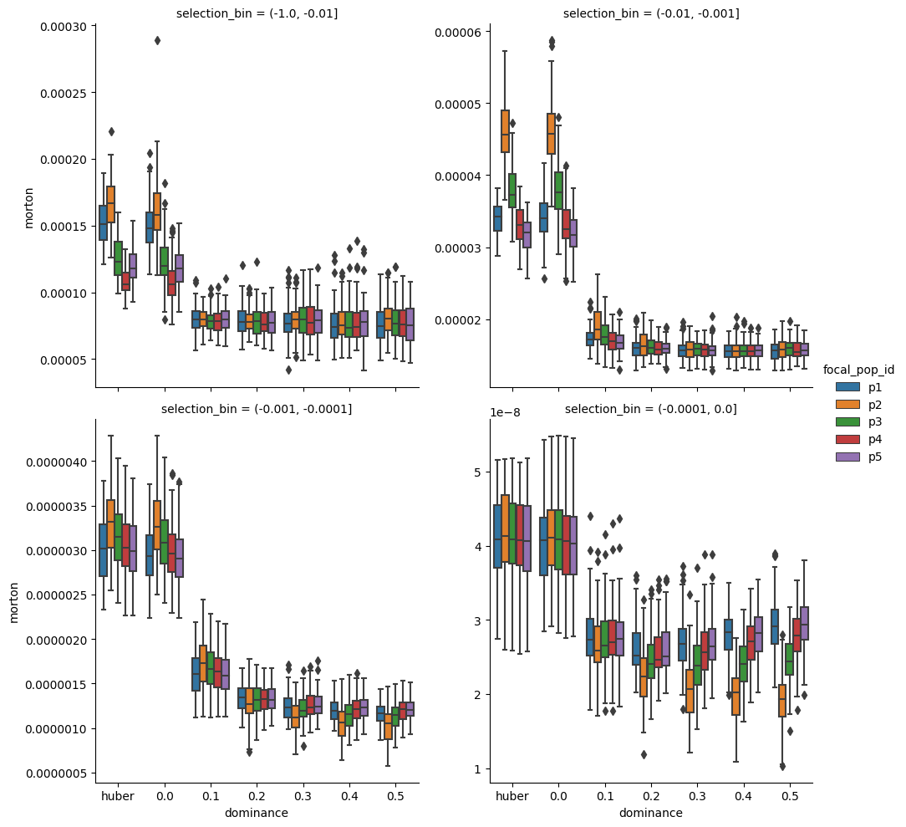

#Results of SLIM3 simulations

In this document we will look to some effects of negative selection under
different dominance constraints on the genetic variability of human admixed
populations. 

Using SILM3 we stimulated deleterious mutations in chromosomes of 1M bp with
selection coefficient sampled from a gamma distribution DFE (shape = -0.0065
and rate = 0.186). The mutations rate was set to 1e-17 and the recombination
rate used was 1e-8. For each simulation we assumed a fixed dominance
coefficient varying from  h= 0 (totally recessive effects) to h = 0.5 (additive
effects).  In addition to the fixed dominance we also simulated the model
proposed by Huber et.al. 2018 where the dominance is a function of selection h
= 1/(a + b \* s) where h(s=0) = 1/a = 0.5 is the value of dominance of neutral
mutations and b = 1e6. 

Here we will show the results of simulations of humans Out-Of-Africa demography
inferred of by Jouganous2017. In this model, humans first expand its effective
population size from 11273 individuals to 23721 in the African Continent around
302 kyears (1 generation is equal 29 years). The Out-of-Africa split takes
place 125 kyears in the past with a population with 3004 effective size. The
European population starts to exponentially increase in its size around 42
kyears after starting from initial size of 2271 when a bottleneck took place.
Finally, we create 3 admixed population from a single pulse admixture between
the African and European population for with 0.25, 0.5, 0.75 proportions of
Africa ancestry.  

In the following figures the African population label is p1 the European
population label is p2. The labels p3, p4 and p5 corresponds populations
with 25\%, 50\%, 75\%  of Africa ancestry.  

The boxplots summarizes the results of 100 simulations, and in each simulation
we sampled 1000 individuals from each population. The quadrants in the figures
shows the resulting statistics for aggregations of deleterious variants by the
magnitude of its selection coefficient. 

### Morton Genetic load  

The Morton genetic load is defined as the average number of deleterious
mutations by individual in a population which can be computed from as the sum
of the mean frequency of deleterious mutation (or sum of the first frequency
moment). 

### Genetic load 

The genetic load is defined as L = -s sum \[2h x1 + (1 - 2h) x2] 
(I forgot to multiply the load value by -1 in the figure)

### Genetic diversity

The genetic diversity is defined as the summation of the nucleotide
heterozygousity 

### Number of segregating sites 

### Morton efficacy

The Morton measures the rate in which selection removes deleterious mutations
in a populations. 

## Conclusions 

* It is possible to see an accumulation of extremely deleterious mutations in the
simulated European population in relation with the African population. This
accumulation is very pronounced when the mutations are totally recessive, but
it is still present for different values of h.  

* Most of the statistics for the admixed populations are between the values for
  the European and African populations. 

* The number of segregating sites in the admixed populations is higher then in
  the parental populations. 
  

## Caveats 

* The DFE used in this simulations is narrower then the one estimated for
  humans in the recent literature. 
* The coefficient b used also is too big making most variants almost recessive.
* The simulation takes too much time to run, probably I will need to rescale
  the effective pop size so it can run faster. 

##  Next steps

* Replicate this results on the gnomAD data set and check if there is an
  accumulation of deleterious mutation for European and East Asian population
  using the rank of score of several functional annotations such as CADD, Gerp,
  etc as a proxy for selection coefficients. 

* Replicate the results of the slim simulations using WF diffusion simulations.
  This will need to be done using dadi since the Moments get numeric errors for
  values of 2Ns < -50.  
